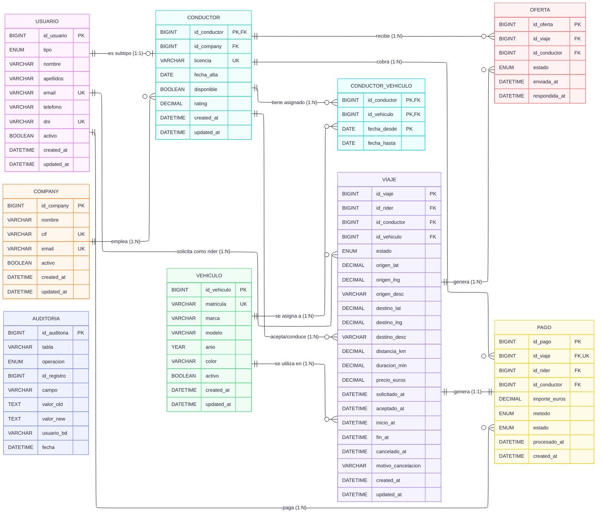

### Diseño de la Base de Datos Ride-Hailing  - BBDD Avanazadas
### Autores: Javier Picazo, Alejandro Bernaldo de Quiros, Pablo Cerdeira y Jaime Ordovás
### Grupo: 3A

---

# Diseño de la Base de Datos Ride-Hailing
## 1. Introducción
Base de datos relacional para una plataforma de ride-hailing (tipo Uber/Cabify) sobre **MySQL 8.0 con InnoDB**. El sistema cubre el ciclo de vida completo: un rider solicita un viaje, se generan ofertas a multiples conductores, el primero que acepta se queda el viaje y el pago.

## 2. Modelo Entidad-Relacion con Mermaid

## 3. Decisiones de diseño
### 3.1. Herencia usuario -> conductor
Riders y conductores comparten la tabla `usuario` con un campo `tipo` ENUM. El conductor tiene una tabla adicional `conductor` con relación 1:1 (su PK es FK a `usuario`). Esto permite...

- Unicidad global de email y DNI en una sola tabla.
- JOINs simples para obtener datos completos del conductor.
- Evitar duplicacion de columnas comunes (nombre, tlf, etc...).

### 3.2. Relacion N:N temporal conductor <-> vehículo
La tabla `conductor_vehiculo` tiene PK compuesta `(id_conductor, id_vehiculo, fecha_desde)` y un campo `fecha_hasta` nullable. Si `fecha_hasta IS NULL`, la asignacion esta vigente. Esto permite mantener historial de que vehiculo uso cada conductor en cada momento.

### 3.3. Ciclo de vida del viaje con timestamps
El viaje tiene un campo `estado` ENUM con 5 valores posibles y un timestamp dedicado para cada transición (`solicitado_at`, `aceptado_at`, `inicio_at`, `fin_at`, `cancelado_at`). Esto permite calcular tiempos de espera, duración real, etc. sin perder informacion.

### 3.4. Concurrencia en aceptación de ofertas
El requisito principal es que **solo el primer conductor que acepte se quede el viaje**. Se resuelve con el stored procedure `sp_aceptar_oferta` que usa `SELECT ... FOR UPDATE` sobre la oferta y el viaje dentro de una transaccion. Al bloquear la fila, cualquier conductor concurrente espera y al obtener el lock ve que el viaje ya no esta en `solicitado`.

### 3.5. Pago 1:1 con viaje
La tabla `pago` tiene un `UNIQUE KEY` sobre `id_viaje`, garantizando que cada viaje finalizado produce exactamente un pago. Esto simplifica la contabilidad y evita duplicados.

### 3.6. Borrado lógico
Ninguna entidad se borra fisicamente. Usuarios, vehículos y companies tienen un campo `activo` (BOOLEAN). Las FKs usan `ON DELETE RESTRICT` para impedir borrados accidentales. Las ofertas se marcan como `expirada` en lugar de eliminarse.

### 3.7. Auditoria automatica con triggers
Tres triggers `AFTER INSERT/UPDATE` sobre `viaje` y `oferta` registran cambios en la tabla `auditoria`. Se usa el operador NULL-safe `<=>` para comparar valores que pueden ser NULL.

## 4. Índices
| Índice | Tabla | Columnas | Justificación |
|--------|-------|----------|---------------|
| `idx_viaje_estado` | viaje | (estado) | Filtro más frecuente en dashboards y operativa |
| `idx_viaje_rider` | viaje | (id_rider) | Historial de viajes de un rider |
| `idx_viaje_conductor` | viaje | (id_conductor) | Viajes por conductor, ingresos |
| `idx_viaje_solicitado_at` | viaje | (solicitado_at) | Ordenación cronológica, filtros por fecha |
| `idx_viaje_estado_fecha` | viaje | (estado, solicitado_at) | Compuesto: viajes finalizados en rango de fechas |
| `idx_oferta_viaje_estado` | oferta | (id_viaje, estado) | Buscar ofertas pendientes de un viaje (sp_aceptar_oferta) |
| `idx_oferta_conductor` | oferta | (id_conductor) | Tasa de aceptación por conductor |
| `idx_usuario_nombre` | usuario | (nombre, apellidos) | Búsquedas por nombre |
| `idx_usuario_tipo` | usuario | (tipo) | Filtrar riders vs conductores |
| `idx_conductor_company` | conductor | (id_company) | Métricas por company |
| `idx_conductor_disponible` | conductor | (disponible) | Conductores disponibles para ofertas |
| `idx_pago_conductor` | pago | (id_conductor, estado) | Ingresos por conductor |
| `idx_pago_rider` | pago | (id_rider) | Historial de pagos del rider |
| `idx_audit_tabla_id` | auditoria | (tabla, id_registro) | Auditoría de un registro concreto |
| `idx_audit_fecha` | auditoria | (fecha) | Auditoría por rango temporal |

## 5. Vistas
| Vista | Propósito |
|-------|-----------|
| `v_viajes_detalle` | Desnormaliza viaje + rider + conductor + company + vehículo. Simplifica consultas del dashboard. |
| `v_conductor_publico` | Expone solo datos no sensibles del conductor (sin DNI ni email). Patrón de seguridad por vistas. |
| `v_metricas_conductor` | Agrega KPIs por conductor: viajes, ingresos, km medio, tasa de aceptación. |
| `v_metricas_company` | Agrega KPIs por company: conductores, viajes, ingresos, tasa de aceptación. |

## 6. Stored procedures
| Procedure | Función | Mecanismo de concurrencia |
|-----------|---------|---------------------------|
| `sp_aceptar_oferta` | Acepta una oferta, asigna conductor al viaje, rechaza el resto de ofertas | `SELECT ... FOR UPDATE` sobre oferta y viaje |
| `sp_iniciar_viaje` | Cambia estado a `en_curso`, marca conductor como no disponible | `FOR UPDATE` sobre viaje |
| `sp_finalizar_viaje` | Calcula precio, finaliza viaje, crea pago, libera conductor | `FOR UPDATE` sobre viaje |

## 7. Seguridad
Hay 4 roles con principio de minimo privilegio:
- **rol_app**: SELECT/INSERT/UPDATE + EXECUTE (API backend).
- **rol_analytics**: SELECT solo sobre vistas (reporting).
- **rol_backup**: SELECT + RELOAD + LOCK TABLES (mysqldump).
- **rol_dba**: ALL PRIVILEGES sobre ridehailing + PROCESS/RELOAD global.

## 8. Backup
- **RPO**: 1 hora (binlog continuo entre backups).
- **RTO**: 4 horas (restore completo + replay binlog).
- Backup completo diario con `mysqldump --single-transaction` a las 03:00AM.
- Binlog en formato ROW para PITR.
- Retención: 7 días de backups + 7 días de binlogs.