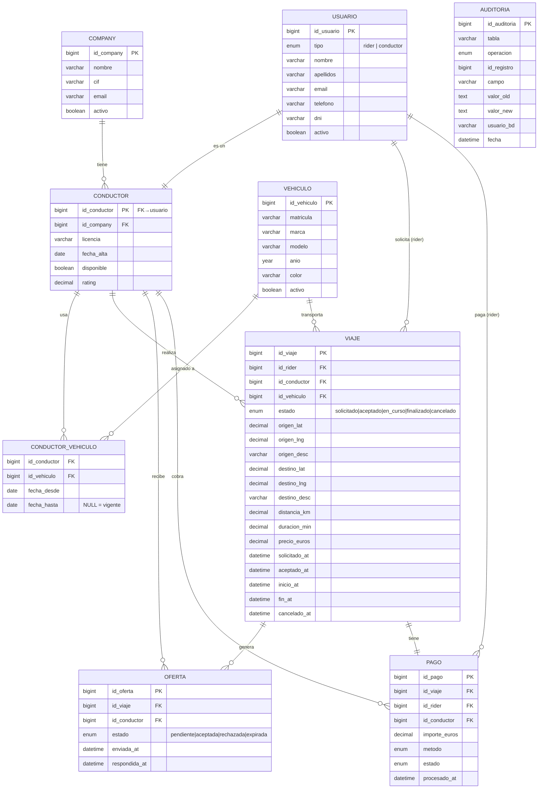

# DESIGN.md — Diseño de la Base de Datos Ride-Hailing

## 1. Descripción General

Base de datos relacional para una plataforma de ride-hailing (estilo Uber/Bolt).  
Motor: **MySQL 8.0** con `InnoDB` en todas las tablas.

---

## 2. Modelo Entidad-Relación (MER)



---

## 3. Descripción de Tablas

### `company`
Empresas propietarias de flotas. Un conductor pertenece a exactamente una company.

### `usuario`
Tabla unificada de personas del sistema. El campo `tipo` distingue riders de conductores.
Usar una sola tabla evita duplicar email, dni y datos de contacto.

### `conductor`
Extiende `usuario` (relación 1:1) con datos propios del conductor: empresa, licencia, disponibilidad y rating.
La PK `id_conductor` es también la FK a `usuario`, garantizando que todo conductor es antes un usuario.

### `vehiculo`
Catálogo de vehículos de la flota. Un vehículo puede ser asignado a varios conductores a lo largo del tiempo.

### `conductor_vehiculo`
Tabla intermedia N:N con vigencia temporal. `fecha_hasta = NULL` indica la asignación activa.

### `viaje`
Entidad central. Almacena el ciclo de vida completo (timestamps por estado), geolocalización y métricas finales.
`id_conductor` es NULL hasta que alguien acepta la oferta.

### `oferta`
Registro de cada oferta enviada a cada conductor para un viaje.  
La restricción `UNIQUE (id_viaje, id_conductor)` impide duplicados.  
El stored procedure `sp_aceptar_oferta` usa `FOR UPDATE` para garantizar que **solo el primer conductor en aceptar** se queda el viaje (evita race conditions).

### `pago`
Un viaje genera exactamente un pago (`UNIQUE id_viaje`). Incluye método y estado del cobro.

### `auditoria`
Registro de cambios sensibles. Se puebla mediante triggers en tablas clave.

---

## 4. Índices

| Índice | Tabla | Columnas | Propósito |
|--------|-------|----------|-----------|
| `idx_viaje_estado` | viaje | estado | Filtrar viajes activos |
| `idx_viaje_rider` | viaje | id_rider | Historial de un rider |
| `idx_viaje_conductor` | viaje | id_conductor | Viajes de un conductor |
| `idx_viaje_solicitado_at` | viaje | solicitado_at | Ordenar por fecha |
| `idx_viaje_estado_fecha` | viaje | estado, solicitado_at | Dashboard (estado+fecha) |
| `idx_oferta_viaje_estado` | oferta | id_viaje, estado | Ofertas pendientes de un viaje |
| `idx_oferta_conductor` | oferta | id_conductor | Historial de ofertas de un conductor |
| `idx_conductor_company` | conductor | id_company | Conductores de una company |
| `idx_conductor_disponible` | conductor | disponible | Conductores disponibles |
| `idx_pago_conductor_estado` | pago | id_conductor, estado | Ingresos por conductor |

---

## 5. Concurrencia — Cómo se evita la doble aceptación

El requisito más crítico: **solo un conductor acepta un viaje**.

El stored procedure `sp_aceptar_oferta` implementa:

```
START TRANSACTION
  SELECT oferta ... FOR UPDATE       ← bloqueo exclusivo sobre la oferta
  SELECT viaje  ... FOR UPDATE       ← bloqueo exclusivo sobre el viaje
  if oferta.estado != 'pendiente' → ROLLBACK
  if viaje.estado  != 'solicitado' → ROLLBACK
  UPDATE oferta SET estado = 'aceptada'
  UPDATE oferta (resto) SET estado = 'rechazada'
  UPDATE viaje  SET estado = 'aceptado', id_conductor = ...
COMMIT
```

`FOR UPDATE` pone un bloqueo exclusivo de fila (InnoDB), de modo que si dos conductores lanzan `sp_aceptar_oferta` al mismo tiempo, el segundo esperará al COMMIT del primero y luego verá que el viaje ya está `aceptado` → ROLLBACK.

---

## 6. Usuarios y Seguridad

| Usuario | Rol | Permisos |
|---------|-----|----------|
| `api_app` | `rol_app` | SELECT, INSERT, UPDATE + DELETE en oferta + EXECUTE |
| `bi_reports` | `rol_analytics` | SELECT solo en vistas (sin tablas) |
| `backup_user` | `rol_backup` | SELECT + RELOAD + LOCK TABLES |
| `exporter` | `rol_monitor` | PROCESS + REPLICATION CLIENT + SELECT |
| `dba_admin` | `rol_dba` | ALL en ridehailing, solo desde localhost |

---

## 7. Plan de Backup

| Backup | Frecuencia | Herramienta | Retención |
|--------|-----------|-------------|-----------|
| Completo lógico | Diario 03:00 | `mysqldump` + gzip | 7 días |
| Binlog incremental | Continuo | MySQL binlog (ROW) | 7 días |

**RPO = 1 hora** (binlog captura todos los cambios entre backups).  
**RTO = 4 horas** (restore completo + replay de binlog).

Para PITR: restaurar el backup completo más reciente y aplicar el binlog hasta el momento deseado con `mysqlbinlog --stop-datetime`.

---

## 8. Monitorización

Stack: **Prometheus + Grafana + mysqld_exporter** (todo en Docker Compose).

Dashboards disponibles:
- **DB metrics**: conexiones, buffer pool hit ratio, slow queries, deadlocks, tamaño de tablas.
- **Business metrics**: viajes por hora, tasa de aceptación, ingresos por conductor/company, tiempos de espera.

Importar en Grafana → Dashboard ID `7362` (MySQL Overview).
